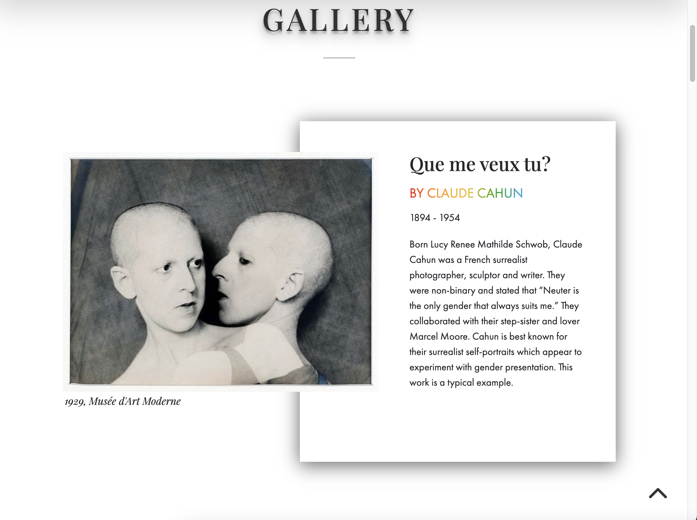
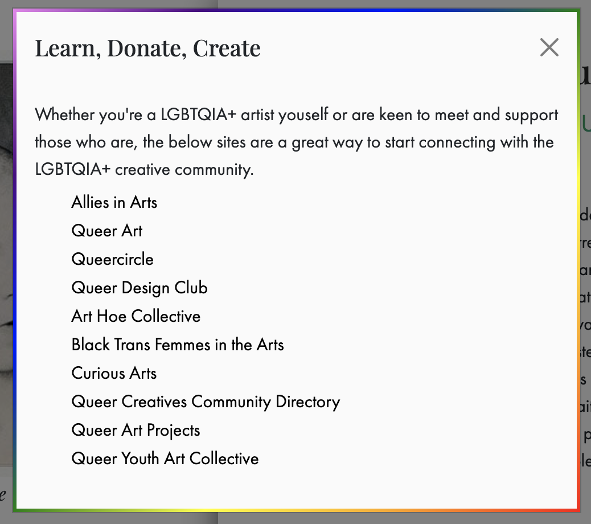
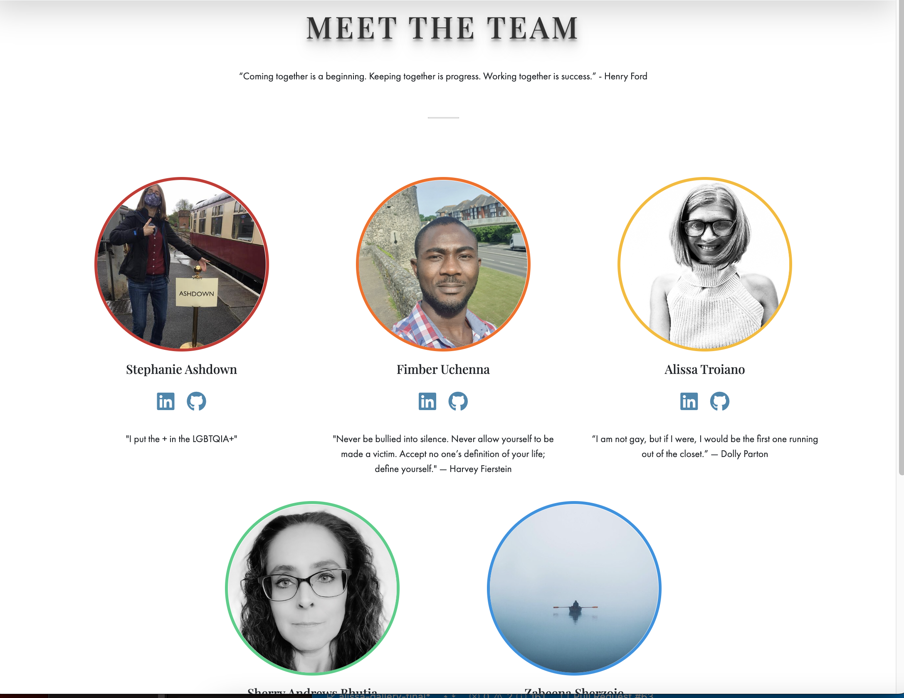

# **PAINTS**

[Link to Live Project](https://grey-infotech-ltd.github.io/paints/)

## Table of Contents
- [**PAINTS**](#paints)
  - [Table of Contents](#table-of-contents)
  - [Introduction](#introduction)
  - [UX](#ux)
    - [User Stories](#user-stories)
    - [Wireframes](#wireframes)
  - [Features](#features)
    - [Existing Features](#existing-features)
      - [Navigation Bar](#navigation-bar)
      - [Website Theme Logo](#website-theme-logo)
      - [Jumbotron](#jumbotron)
      - [Gallery](#gallery)
      - [Gallery Dropdown](#gallery-dropdown)
      - [Team](#team)
    - [Features Left to Implement](#features-left-to-implement)
  - [Technologies Used](#technologies-used)
    - [Languages Used](#languages-used)
    - [Frameworks, Libraries & Programs Used](#frameworks-libraries--programs-used)
  - [Testing](#testing)
    - [Validator Testing](#validator-testing)
    - [Manual Testing](#manual-testing)
  - [Deployment](#deployment)
    - [GitHub Pages](#github-pages)
    - [Forking the GitHub Repository](#forking-the-github-repository)
    - [Cloning the GitHub Repository](#cloning-the-github-repository)
  - [Credits](#credits)
    - [Code](#code)
    - [Content](#content)
    - [Media](#media)
    - [Other](#other)

## Introduction

This is a website providing information about all type of art throughout history. In keeping with Pride 2022 Theme: Togetherness, this website provides information on famous LGBTQA+ artists along with photo representation of a quintessential art piece from their repertoire. The website also provides information on LGBTQA+ artists, organisations and charities and how they can be contacted. The site is targeted towards not just the LGBTQA+ community, but to those interested in expanding their knowledge of art and looking to support LGBTQA+ artists donating or by adding to their art collection.

[The live project can be found here.](https://grey-infotech-ltd.github.io/paints/)

## UX

### User Stories

1. As a user, I want to easily navigate the website, so that my time isn't wasted.
2. As a user, I want to quickly understand what the site is about, so that I can decide if it is of interest to me.
3. As an LGBTQA+ art lover, I want to learn find information about LGBTQA+ artists from history, so that I can learn more about them.
4. As someone interested in LGBTQA+ art and artists, I want to find sites that showcase and support them, so that I can get more involved.

### Wireframes

The following wireframe was created to help plan the layout of the site:

## Features

### Existing Features

#### Navigation Bar

* Located concisely at the top right of every page 
* The user can easily navigate to different sections of the site with ease.
* This feature solves user story 1.

#### Website Theme Logo

* Logo is located at the top left of the home page for easy access.
* Clicking on the logo will bring the user back to the home page. 

#### Jumbotron

* Explains what the site is about.
* The text colour details highlight the pride theme.
* This feature solves user story 2.

#### Gallery

* Provides interesting information to the user on the artists and their connection to the art community.
* Showcases eye catching examples of the artist's work.
* This feature solves user story 3.

#### Gallery Dropdown

* Makes it easy for the user to navigate through the gallery.

#### Modal

* Provides links to extra information if the user wishes to learn more.
* This solves user story 4.

#### Team

* Provides the user with more information about the team behind the project.

### Features Left to Implement

The idea is that the site will evolve into a real art hub for artists and all art fans. There would be an ever constantly udating showcase featuring current artists who are making waves or who should be more appreaciated. There would also be a directory of LGBTQIA+ creatives allowing people to connect with and support them and a marketplace where they could showcase and sell their art. Finally there would be a forum where art fans could come together and discuss their favourite pieces or find information on classes, meet-ups and events.

## Technologies Used

### Languages Used
* [HTML5](https://en.wikipedia.org/wiki/HTML5)
* [CSS3](https://en.wikipedia.org/wiki/CSS)
* [JavaScript](https://en.wikipedia.org/wiki/JavaScript)

### Frameworks, Libraries & Programs Used
* [AOS Library](https://michalsnik.github.io/aos/)
* [Bootstrap 5](https://getbootstrap.com/)
* [Font Awesome](https://fontawesome.com/)
* [Google Fonts](https://fonts.google.com/)
* [Adobe Fonts](https://www.adobe.com/products/typekit.html)

## Testing

### Validator Testing

**[HTML W3C Validator:](https://validator.w3.org/)**
* A check on the team page showed a duplicate id on the footer logo and an incorrect id on the modal header. These have been renamed on the team and index page.
* No other errors were found on the team page.
* Spurious ending anchor tags were found on the image captions on the index page. These have been removed.
* An incorrect character in the boostrap script link on the index page has been removed.
* There are a number of other validator errors on the index page. It was not possible to fix these in time.

**[CSS Jigsaw Validator:](https://jigsaw.w3.org/css-validator/)**
* No errors were found.

**[JavsScript JSHint Validator:](https://jshint.com/)**
* No errors were found.

### Manual Testing

**Navigation Bar**
* All links take the user to the correct page or part of the page.
* The Gallery dropdown menu displays correctly and the links work as expected.
* The navigation collapses to a toggle on smaller screens.

**Footer**
* The social media links take the user to the correct page and open in a new tab.
* The in site links take the user to the corect page or part of page.
* A bug in the 'Get Involved' modal launch button on the team page has been corrected.

**Index Page**
* The to gallery and back to top arrows take the user to the correct parts of the page.
* The artist section animations work as expected.

**Team Page**
* The team member LinkedIn and Github links take the user to the correct pages and open in a new tab.

**Get Involved Modal**
* The modal launches when the button is clicked.
* The links take the user to the correct page and open in a new tab.

**Tested User Experience**
* As someone in the LGBTQA+ community, I love the minimalistic quality and easy navigation to the site. The rainbow colors in the logo are consistent with the minimalistic theme. This allows the rainbow colours and navigation bar stand out. I can scroll down to the gallery with ease and am met with a twirlng animated representation of the artists individually. I can easily read about the artist and view a piece in their collection. I can easily get acquainted with the artists and their work, even on a short coffee break. I can also use the 'virtual tour' to easily and quickly educate others about the artists both past and present in our community. 
* As an art collector looking to expand my art collection, I found this website esthetically pleasing and easy to navigate. I am already familiar with the pieces and the artists represented in the gallery. And the expereince of the gallery is just that: 'a virtual gallery'. The background of the site reminds me of the art galleries i frequent and the artwork and respective artists descriptions are what I've come to expect at art shows. The navigation bar at the top is clearly visable and consistent, no matter where in the site I am. Upon clicking on the 'Get Involved' section of the navigation bar, I was met with a fine list of local artists, as well as additional information on organizations supporting the LGBTQA+ community. 

## Deployment

### GitHub Pages

The project was deployed to GitHub Pages. The following steps are used to deploy the site:
* Navigate to GitHub and locate and select the GitHub repository.
* Navigate to the settings tab and select the 'Pages' tab from the menu.
* Under 'Source' click the dropdown labelled 'None' and select the 'master' branch.
* Click save. The page will automatically refresh and the published site link can be found on the 'Pages' tab.
* The link can be found here - link to live site

### Forking the GitHub Repository

The following steps can be used to fork the GitHub repository:
* On GitHub navigate to the main page of the repository.
* The 'Fork' button can be found on the top righthand side of the screen.
* Click the button to create a copy of the original repository.

### Cloning the GitHub Repository

The following steps can be used to clone the GitHub repository:
* On GitHub navigate to the main page of the repository.
* Above the list of files select 'Code'.
* Three options are provided, HTTPS, SSH and GitHub CLI. Select the appropriate option and click the 'Copy' button next to the URL.
* Open Git Bash.
* Change the working directory to the location for the cloned directory.
* Type git clone and paste the copied URL.
* Press 'Enter' to create the clone.

## Credits

### Code

  * [MyCharger](https://grey-infotech-ltd.github.io/mycharger/team.html) team page was used to help with the styling of the team page.
  * [TwistWord](https://grey-infotech-ltd.github.io/twistword/developer-page.html) team page was used to help with the styling of the team page.
  * This [Codepen](https://codepen.io/bartveneman/pen/PQMzxp) was used to create the layout for the gallery pieces.
  * [Mozilla]https://developer.mozilla.org/en-US/docs/Web/CSS/grid-template-rows) was used to create the layout for the gallery pieces.

### Content

* Information about the artists has been taken from [Wikipedia](https://en.wikipedia.org/wiki/Main_Page), [The Tate](https://www.tate.org.uk/), [The Royal Academy](https://www.royalacademy.org.uk/) and [MoMA](https://www.moma.org/).

### Media
* Claud Cahun's Que me veut tu? is owned by the [Musee d'Art Modern](https://www.mam.paris.fr/en).
* Gluck's Medallion is found in a Private Collection (photo by Christie's Images).
* Beauford Delaney's Can Fire in the Park is owned by the [Smithsonian American Art Museum](https://americanart.si.edu/).
* Frida Kahlo's Las dos Fridas is owned by the [Museo de Arte Moderno](https://mam.inba.gob.mx/).
* Copyright for Francis Bacon's portrait of George Dyer in a Mirror is owned by the Estate of Francis Bacon.
* Copyright for Andy Warhol's Brillo Box is owned by the Andy Warhol Foundation for the Visual Arts.
* Robert Mapplethorpe's Self Portrait is owned by the [Solomon R. Guggenheim Museum](https://www.guggenheim.org/).
* Keith Haring's Ignorance = Fear / Silence = Death is owned by the [Whitney Museum of American Art](https://whitney.org/).
* Copyright for Catherine Opie's Chicken is owned by Catherine Opie.
* Copyright for Zanele Muholi's ID Crisis is owned by Zanele Muholi.
* The jumbotron image was licensed from [Adobe Stock](https://stock.adobe.com/163166422)

### Other

* The Code Institute [template](https://github.com/Code-Institute-Org/gitpod-full-template) was used to make the project repository on GitHub.
* The wireframes for the project were created using [Balsamiq](https://balsamiq.com/wireframes/desktop/).
* The mockup of the website in the README.md was created using [Am I Responsive?](https://ui.dev/amiresponsive).